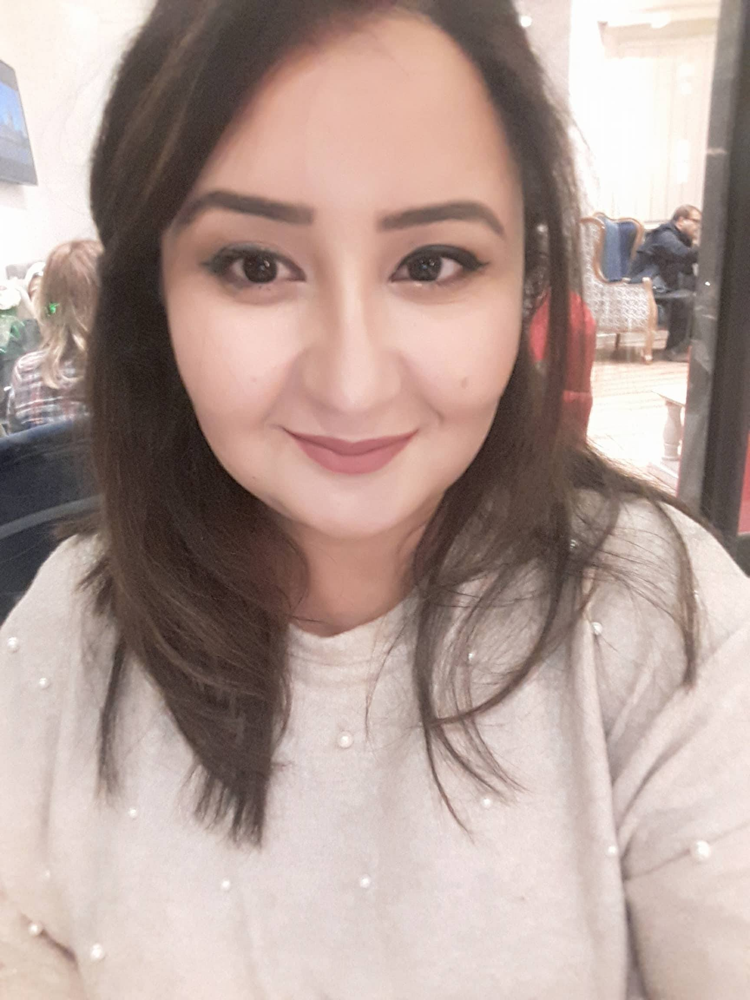

---
---

<link rel="stylesheet" href="styles.css" type="text/css">

  I am is a PhD candidate at the artificial intelligence group of the TU Dortmund, Germany. I work as a research assistant in the B3 project (Data Mining on Sensor Data of Automated Processes) of the Collaborative Research Center SFB 876 - Providing Information by Resource-Constrained Data Analysis. My main research is about ensemble methods, time series analysis and forecasting and active learning. I received her MSc of engineering in 2016 from Tunisia Polytechnic School, Carthage University.	

I am a well-known R enthusiast.

My full CV is available [here](files/resume.pdf).